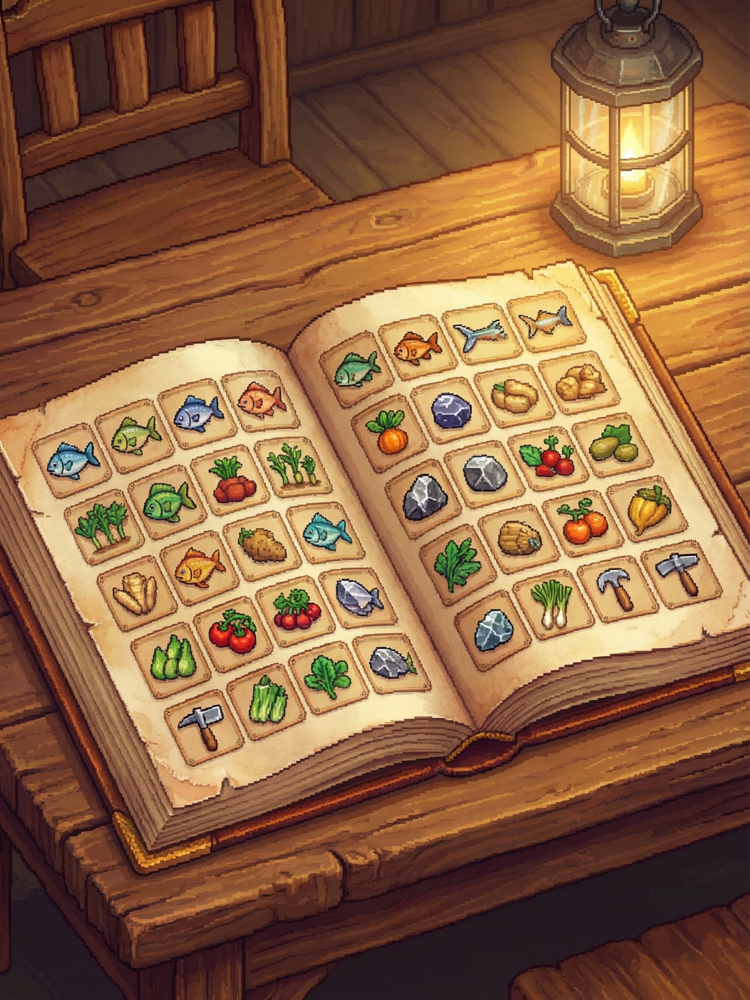
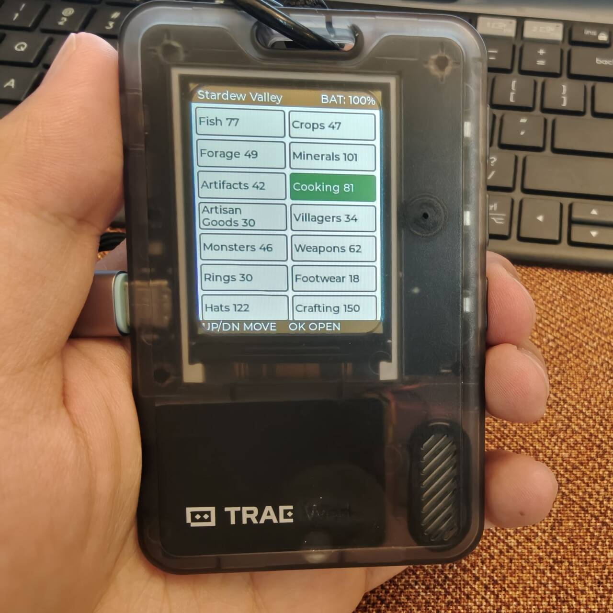
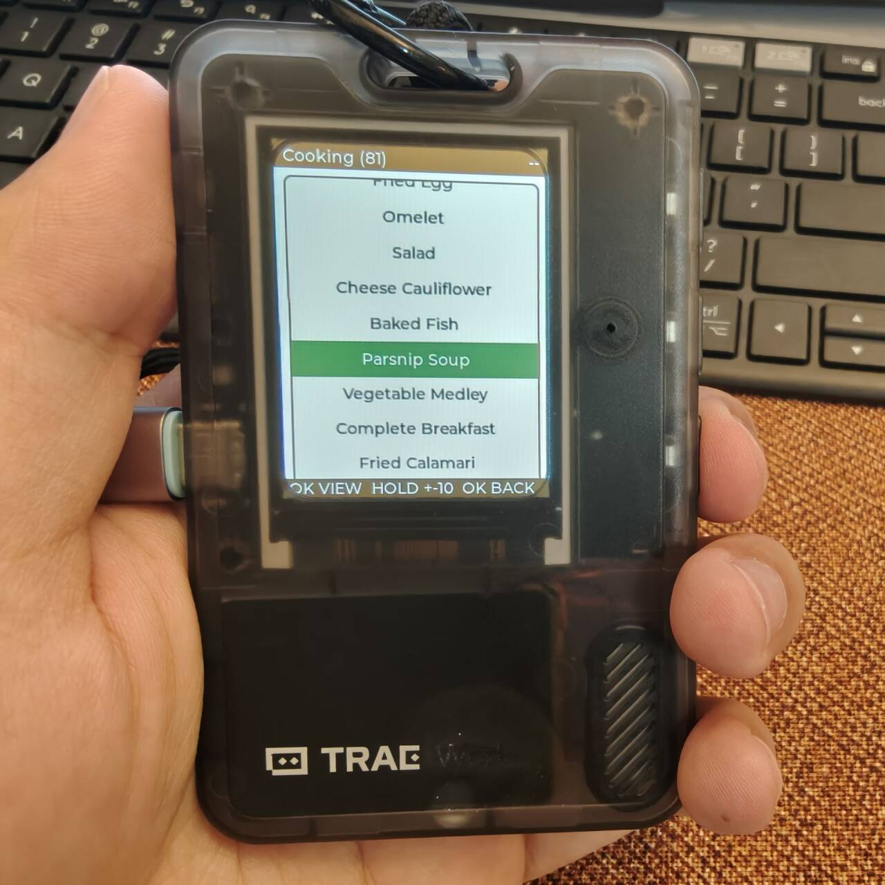
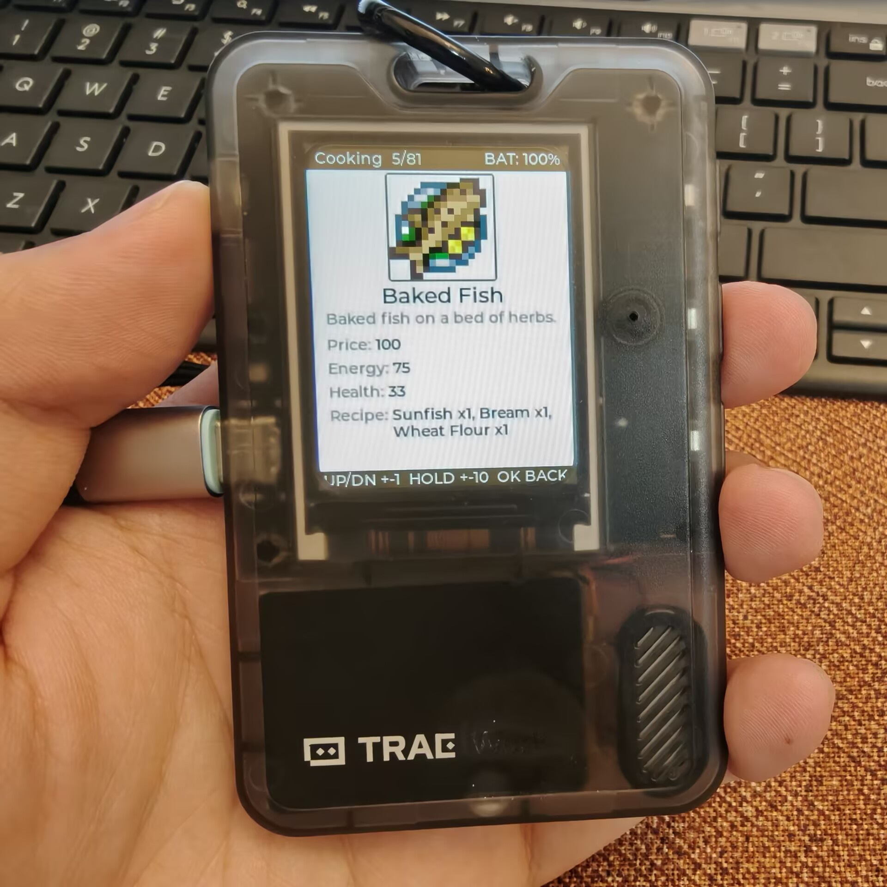
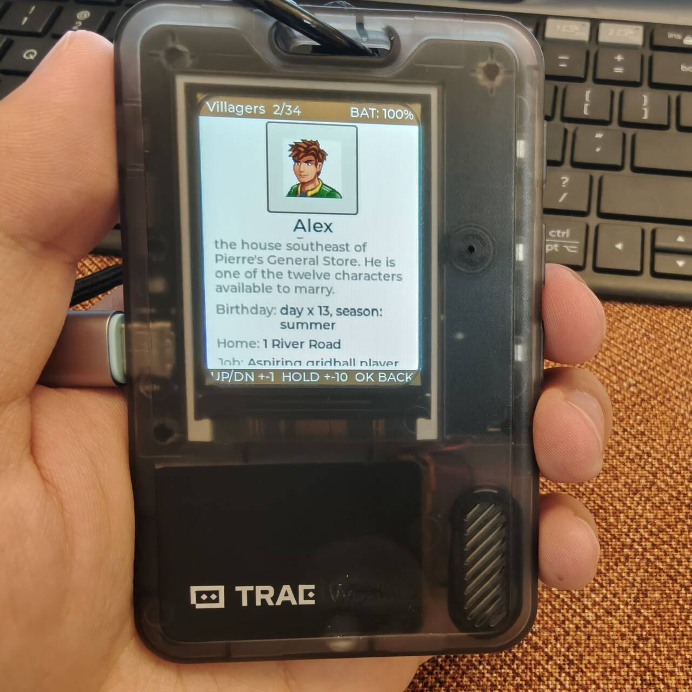

# AI Passport — 星露谷物语图鉴



面向 [FoloToy AI Passport](https://github.com/FoloToy/ai-passport) 硬件
（ESP32-C3、8 MB Flash、240x320 ST7789 屏、三按键 ADC 键盘）的星露谷物语
离线图鉴固件。

完全离线运行：无 WiFi、无蓝牙、无网络。全部数据 —— **30 个类别、1161 条
条目、1092 张像素图** —— 均嵌入 3 MB factory 应用镜像内。

## 实机截图

| 分类网格 | 条目列表 | 详情 | 村民 |
|:---:|:---:|:---:|:---:|
|  |  |  |  |

## 功能

- **30 个类别**：鱼、作物、采集物、矿物、古物、烹饪、工匠物品、村民、怪物、
  武器、戒指、鞋类、帽子、合成配方、动物、鱼饵、鱼钩、怪物战利品、树木、
  工具、饰品、特殊物品、星之果实、稻草人、影院零食、成就、混合种子、
  失落之书、技能、建筑。
- **详情页**：像素形象、名称、描述以及每条目最多 5 行属性。
- **位置记忆**：上次浏览的条目在重启后从 NVS 恢复。
- **像素级渲染**：精灵图以 RGB565 存储、透明色预混星露谷纸色背景、
  raw-DEFLATE 压缩，运行时经 miniz 解压并对小图做 2x 最近邻放大。
- **电量与息屏**：屏幕显示电量；60 秒无操作后背光调暗。
- **全文信息面板**：描述与属性行绝不省略；内容超出面板高度时以
  无缝 marquee 循环自动滚动。
- **背景音乐**：开机自动循环播放 Stardew Valley Overture（完整 2:26）；
  IMA ADPCM 8kHz 单声道嵌入固件，零外部依赖。

## 按键操作

| 页面 | 按键 | 动作 |
| --- | --- | --- |
| 分类网格 | UP / DOWN（单击） | 移动选择 |
| 分类网格 | OK（单击） | 进入类别 |
| 条目列表 | UP / DOWN（单击） | 移动选择 |
| 条目列表 | UP / DOWN（长按） | 跳 +-10 条 |
| 条目列表 | OK（单击） | 打开条目 |
| 条目列表 | OK（长按） | 返回分类 |
| 详情页 | UP / DOWN（按下） | 上/下一条（环绕） |
| 详情页 | UP / DOWN（长按） | 跳 +-10 条 |
| 详情页 | UP / DOWN（双击） | 跳到首条 / 末条 |
| 详情页 | OK（长按） | 返回列表 |
| 详情页 | OK（双击） | 静音 / 取消静音 |

## 仓库结构

```
main/                 固件应用（纯 C 核心 + LVGL 界面）
  dex_core.c/h        静态数据访问 + 属性串解析
  dex_sprite.c/h      运行时精灵解压 + 2x 缩放
  dex_layout.c/h      240x320 屏幕布局几何
  dex_ui.c            三页面 UI 状态机（分类/列表/详情）
  dex_audio.c/h       BGM 播放（IMA ADPCM 流式解码 + I2S 输出）
  dex_adpcm.c/h       IMA ADPCM 4-bit 解码器（~100 行 C）
  dex_bgm_data.c/h    生成产物：BGM 曲目 C 数组（源自 convert_bgm.py）
  dex_battery.c/h     电量指示 + 空闲背光调暗
  dex_static.c/h      生成产物：条目表 + 属性串池（源自 data JSON）
  dex_sprites.bin     生成产物：精灵图集（TOC + raw-DEFLATE RGB565）
  dex_attrs.bin       生成产物：属性字符串池
  vendor/miniz/       miniz（仅 tinfl）用于 raw-DEFLATE 解压
components/bsp/       板级支持包（来自官方 ai-passport）
bootloader_components/recovery_boot_hook/
                      5 秒 UP 键进入 Recovery 的引导钩子（模板契约）
tools/gen_dex_data.py 数据管线：data JSON -> RGB565 图集 + C 表
tools/convert_bgm.py  BGM 管线：OST MP3 -> IMA ADPCM WAV（ffmpeg）
tools/gen_bgm_data.py BGM 管线：ADPCM WAV -> C 数组嵌入固件
tools/validate_dex_data.py  生成产物一致性校验
数据管线来源          同级仓库 `stardew-valley-data`（data/*.json + images）
docs/                 开发文档
  README.md           功能/架构/构建/故障排查指南
  development-log.md  完整开发过程、踩坑与决策记录
```

## 构建与烧录

需要 ESP-IDF 5.5.x（开发验证于 5.5.5），目标 esp32c3。托管组件
（LVGL 9.5、esp_lvgl_port、espressif/button）在首次配置时自动拉取。

### 从源码构建

```bash
idf.py set-target esp32c3
idf.py build
idf.py merge-bin   # 完整镜像位于 build/merged-binary.bin（约 2.8 MB）
idf.py -p COMx flash monitor
```

### 烧录预编译固件

从 [Releases](../../releases) 下载 `ai-passport-stardew-valley-full.bin`，
使用 `esptool.py` 烧录：

```bash
esptool.py --chip esp32c3 -p COM3 --baud 460800 write_flash 0x0 ai-passport-stardew-valley-full.bin
```

> 将 `COM3` 替换为设备实际串口号。Windows 可在设备管理器中查看。

仅重新生成数据资源时才需要 Python 3.11 + Pillow：

```bash
# 在同级 stardew-valley-data 检出目录存在的前提下
python tools/gen_dex_data.py --data D:\path\to\stardew-valley-data
python tools/validate_dex_data.py --data D:\path\to\stardew-valley-data
```

## 分区契约

完整保留模板分区布局 —— 小程序 BLE 安装器依赖它：

| 名称 | 偏移 | 大小 | 用途 |
| --- | --- | --- | --- |
| nvs | 0x9000 | 24 KB | 键值存储（上次浏览位置） |
| factory | 0x10000 | 3 MB | 应用（图鉴 + 嵌入资源） |
| cardid | 0x356000 | 16 KB | BLE 配对数据（保护区） |
| recovery | 0x700000 | 1 MB | 常驻 Recovery 应用（保护区） |

引导阶段按住 UP 键 5 秒进入 Recovery 的钩子已保留。

## 致谢

- 数据与像素图：[stardew-valley-data](https://github.com/chiefpansancolt/stardew-valley-data)
  社区项目。星露谷物语及全部相关素材版权归 ConcernedApe 所有。本项目为
  非商业同人作品，游戏素材归其所有者。
- 硬件板级支持、Recovery 钩子：[ai-passport](https://github.com/FoloToy/ai-passport)
  （见 `LICENSE.ai-passport`）。
- 图鉴实现思路参考：[sunny0826/ai-passport](https://github.com/sunny0826/ai-passport) `feature/pokedex` 分支。
- miniz：richgel999/miniz（MIT）。

---

# AI Passport — Stardew Valley Dex (English)


An offline Stardew Valley encyclopedia ("dex") firmware for the
[FoloToy AI Passport](https://github.com/FoloToy/ai-passport) hardware
(ESP32-C3, 8 MB flash, 240x320 ST7789 display, three-button ADC keypad).

Everything runs fully offline: no WiFi, no Bluetooth, no network. The entire
dataset — **1161 entries across 30 categories with 1092 pixel sprites** — is
embedded inside the 3 MB factory app image.

## Screenshots

| Category grid | Entry list | Detail view | Villager |
|:---:|:---:|:---:|:---:|
|  |  |  |  |

## Features

- **30 categories**: Fish, Crops, Forageables, Minerals, Artifacts, Cooking,
  Artisan Goods, Villagers, Monsters, Weapons, Rings, Footwear, Hats,
  Crafting, Animals, Bait, Tackle, Monster Loot, Trees, Tools, Trinkets,
  Special Items, Stardrops, Rarecrows, Concessions, Achievements, Mixed Seeds,
  Lost Books, Skills, Buildings.
- **Detail view**: pixel sprite, name, description and up to 5 attribute rows
  per entry.
- **Position memory**: the last viewed entry is restored from NVS on boot.
- **Pixel-perfect rendering**: sprites are stored as RGB565 with the
  transparent color pre-blended onto the Stardew paper background, raw-DEFLATE
  compressed, inflated at runtime with miniz and 2x nearest-neighbor upscaled
  for small art.
- **Battery & idle dimming**: battery indicator on screen; backlight dims
  after 60 s of inactivity.
- **Full-text info panel**: description and attribute rows are never
  ellipsized; content taller than the panel auto-scrolls in a seamless
  marquee loop.
- **Background music**: loops Stardew Valley Overture (full 2:26) on boot;
  IMA ADPCM 8 kHz mono embedded in firmware, zero external dependencies.

## Controls

| Page | Key | Action |
| --- | --- | --- |
| Category grid | UP / DOWN (click) | Move selection |
| Category grid | OK (click) | Enter category |
| Entry list | UP / DOWN (click) | Move selection |
| Entry list | UP / DOWN (long) | Jump +-10 entries |
| Entry list | OK (click) | Open entry |
| Entry list | OK (long) | Back to categories |
| Detail | UP / DOWN (press) | Previous / next entry (wrap) |
| Detail | UP / DOWN (long) | Jump +-10 entries |
| Detail | UP / DOWN (double) | Jump to first / last entry |
| Detail | OK (long) | Back to list |
| Detail | OK (double) | Toggle mute |

## Repository layout

```
main/                 Firmware application (pure C core + LVGL UI)
  dex_core.c/h        Static data access + attribute string parser
  dex_sprite.c/h      Runtime sprite inflate + 2x scaler
  dex_layout.c/h      Layout geometry for the 240x320 screen
  dex_ui.c            Three-page UI state machine (category/list/detail)
  dex_audio.c/h       BGM playback (IMA ADPCM stream decode + I2S output)
  dex_adpcm.c/h       IMA ADPCM 4-bit decoder (~100 lines of C)
  dex_bgm_data.c/h    Generated: BGM track C arrays (from convert_bgm.py)
  dex_battery.c/h     Battery indicator + idle backlight dimming
  dex_static.c/h      Generated: entry table + attribute pool (from data JSON)
  dex_sprites.bin     Generated: sprite atlas (TOC + raw-DEFLATE RGB565)
  dex_attrs.bin       Generated: attribute string pool
  vendor/miniz/       miniz (tinfl only) for raw-DEFLATE decompression
components/bsp/       Board support package (from upstream ai-passport)
bootloader_components/recovery_boot_hook/
                      Permanent 5-second UP-key recovery hook (template contract)
tools/gen_dex_data.py Data pipeline: data JSON -> RGB565 atlas + C tables
tools/convert_bgm.py  BGM pipeline: OST MP3 -> IMA ADPCM WAV (ffmpeg)
tools/gen_bgm_data.py BGM pipeline: ADPCM WAV -> C arrays for firmware
tools/validate_dex_data.py  Generated-artifact consistency validator
data pipeline source  sibling repo `stardew-valley-data` (data/*.json + images)
docs/                 Development docs
  README.md           Feature/architecture/build/troubleshooting guide
  development-log.md  Full development process, pitfalls and decisions
```

## Building

Requires ESP-IDF 5.5.x (developed against 5.5.5) with the esp32c3 target.
Managed components (LVGL 9.5, esp_lvgl_port, espressif/button) are fetched on
first configure.

### Build from source

```bash
idf.py set-target esp32c3
idf.py build
idf.py merge-bin   # complete image at build/merged-binary.bin (about 2.8 MB)
idf.py -p COMx flash monitor
```

### Flash prebuilt firmware

Download `ai-passport-stardew-valley-full.bin` from
[Releases](../../releases) and flash with `esptool.py`:

```bash
esptool.py --chip esp32c3 -p COM3 --baud 460800 write_flash 0x0 ai-passport-stardew-valley-full.bin
```

> Replace `COM3` with your actual serial port. On Windows, check Device Manager.

Python 3.11 + Pillow are required only when regenerating data assets:

```bash
# from the sibling stardew-valley-data checkout
python tools/gen_dex_data.py --data D:\path\to\stardew-valley-data
python tools/validate_dex_data.py --data D:\path\to\stardew-valley-data
```

## Partition contract

The template partition layout is preserved unchanged — the mini-program BLE
installer depends on it:

| Name | Offset | Size | Purpose |
| --- | --- | --- | --- |
| nvs | 0x9000 | 24 KB | Key-value store (last-viewed position) |
| factory | 0x10000 | 3 MB | App (dex + embedded assets) |
| cardid | 0x356000 | 16 KB | BLE pairing data (protected) |
| recovery | 0x700000 | 1 MB | Permanent recovery app (protected) |

The 5-second UP-key bootloader hook into Recovery is retained.

## Credits

- Data and sprites: [stardew-valley-data](https://github.com/chiefpansancolt/stardew-valley-data)
  community project. Stardew Valley and all associated assets are
  Copyright (c) ConcernedApe. This is a non-commercial fan project; game
  assets remain the property of their owner.
- Hardware board support, recovery hook: [ai-passport](https://github.com/FoloToy/ai-passport)
  (see `LICENSE.ai-passport`).
- Pokédex approach reference: [sunny0826/ai-passport](https://github.com/sunny0826/ai-passport) `feature/pokedex` branch.
- miniz: richgel999/miniz (MIT).
